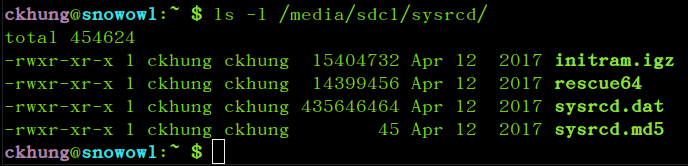
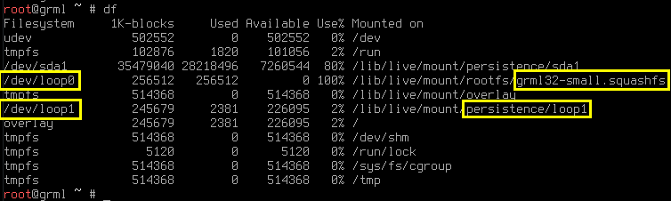
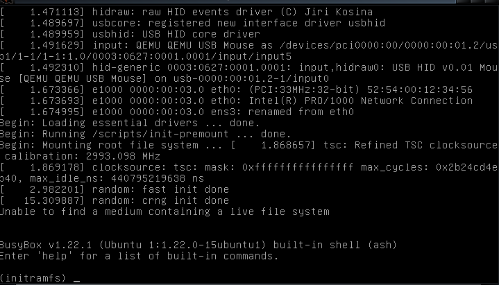
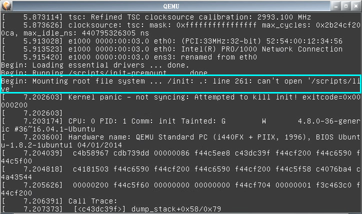

# mbootuz

**Note: mbootuz.py only works with traditional MBR-partitioned disks.
It does not work with GPT-partitioned disks.**

mbootuz.py makes it easier for sys admins to write simple shell scripts
for creating bootable usb flash drive (usb stick).
[The English doc is incomplete but still valid.
Info about ```mbootuz.py cplive``` is missing.
For now, you can follow the links and ```commands``` in the zh_TW doc.
It is written more as a tutorial than a reference manual
and suitable for trying in the text order.]

mbootuz.py 的目標是要讓系統管理員可以寫簡單的 shell scripts 來建立開機隨身碟。
中文文件在後半部。

## Introduction

mbootuz.py has two subcommands:
- ```wipe``` wipes/deletes/kills/destroys all data on the target usb drive,
  creates one vfat partition and one linux partition,
  makes the vfat partition bootable and formats it.
- ```mkboot``` installs mbr into the target usb drive,
  copies /usr/lib/syslinux into the /boot directory of the first partition,
  and installs extlinux into this new /boot/syslinux directory.
  ```mkboot``` will not affect existing partitions or
  existing data on a usb drive.
  Before copying, the (first) target partition can be mounted or unmounted.
  After copying, its mount status will remain the same.

In contrast to its predecessors mk-boot-usb, mbootu2,
and the unpopularised mbootu3,
mbootuz.py does not try to everything for you in one step.
In particular, it does not copy any minimal linux
(e.g. ttylinux or finnix) to the target.
After years of experimenting with linux newbie students,
it is decided that the task of creating a bootable usb
be separated into two parts.
mbootuz.py is intended to be the lower-level part of the task.
Thus the ease of use is sacrificed in exchange for cleaner,
simpler code and better maintainability.
The higher-level part of the task is to be completed
by a somewhat knowledgeable sys admin (the person reading this doc ^_^).
S/he will then create an extlinux.conf and write a short shell script
to invoke mbootuz.py and copy the chosen linux live cd
to the vfat partition or restore a pre-built linux image
to the linux partition, according to the real locations
of the necessary files.

mbootuz.py is developed in a lubuntu 16.04 system
running python 2.7.12 . It requires the fdisk command
and the extlinux package.

## Usage Scenarios

I ask my students to bring to the computer lab
one empty usb drive of size >= 8GB,
and as many other usb drives as possible,
each having >= 512MB available spaces,
and promise not to disturb their existing files on the latter.

To each of the usb drives containing precious data
that cannot be destroyed, I run something like this:
```
    mount /dev/sdz1 /mnt/tmp1
    mbootuz.py mkboot /dev/sdz
    cp -a .../sysrcd .../clonezilla-live-2.5.0-25-amd64.iso /mnt/tmp1
    umount /dev/sdz1
```
The second command installs the boot loader, etc. into /dev/sdz1 .
Note: the sysrcd subdirectory in the cp command should contain
[all the necessary files](http://www.system-rescue-cd.org/manual/Installing_SystemRescueCd_on_the_disk/)
mentioned in extlinux.conf .

To the empty usb drive, I run something like this:
```
    mbootuz.py wipe -L 7G -t 83 /dev/sdz
    mbootuz.py mkboot /dev/sdz
    fsarchiver restfs .../lubuntu-16.04-a.fsa id=0,dest=/dev/sdz2
```
The first command wipes the usb drive, creates an
unformatted 7GB linux partition (type 0x83) /dev/sdz2,
and leaves all the remaining space to the
vfat partition /dev/sdz1, formatted.
The second command installs the boot loader, etc. into /dev/sdz1 .
The third command restores a full linux operating system to /dev/sdz2 .

Or, if you somehow (start from
[here](https://github.com/zfsonlinux/zfs/wiki/Ubuntu-16.10-Root-on-ZFS))
managed to manually install some linux in a usb drive
(let's call its zpool "stem-cell"), then you can use it to boot and 
clone a snapshot of this (running!) OS to a new drive flashy-new-usb as follows
(change paths acoording to your situation):
```
    mount /dev/sdz1 /mnt/tmp1
    cp -r /boot /mnt/tmp2/boot/lu1604z
    umount /dev/sdz1
    zpool create flashy-new-usb /dev/sdz2
    zpool import stem-cell
    zfs list -t snapshot
    zfs send -R stem-cell/ROOT/lu1604z@6-deploy | zfs receive -d -Fu flashy-new-usb
```
**Note**: You must ```zpool export flashy-new-usb ; umount /dev/sdz1```
before you can **remove** the new usb or before you can use **kvm** to test it!

## Options

- ```-L size``` Allocate _size_ space to the linux partition.
  For example, ```-L 6G``` , ```-L 6144M```, and ```-L 6291456K``` are the same.
- ```-x max_size``` Refuse to process target drive of size
  greater than *max_size*. The default is a relatively small
  value so that only usb flash drives gets processed,
  and external/internal harddisks are not
  inadvertently damaged. You can raise this value if you know
  what you are doing.
- ```-t type``` Set linux partition to type _type_ in fdisk.
  For ext2/3/4 file systems, use ```-t 83```.
  For zfs, use ```-t bf```.

## Limitations

To protect the user from inadvertent and disastrous mistakes,
mbootuz.py refuses to work on anything other than /dev/sd[b-z] .
Obviously you can change the source code to remove this limitation.


## 一、 簡介

** 注意： mbootuz.py 僅限用於處理傳統 MBR 方式分割的硬碟/隨身碟。
mbootuz.py 不適用於處理 GPT 方式分割的硬碟/隨身碟。**

```mbootuz.py``` 讓你可以用幾個簡單的指令
(甚至可以寫 shell script) 來製作 linux 開機隨身碟。
它特別適用於某些 debian 衍生版本的 .iso 檔
(例如 grml linux、 AV linux、 kali linux 等等)，
兩個指令就可以從這樣的 .iso 檔製作出開機隨身碟。
它還可以順便建立 persistence 機制來儲存任何變動，
讓你感覺就像在用安裝在硬碟上的版本一樣
(只是佔用空間更小、 安裝速度更快)，
每次重開機都可以接續前次關機前的工作。
你必須用 root 的身份執行它。 

這份文件比較像教學文， 比較不像完整的手冊； 本文適合大致按順序閱讀。
```mbootuz.py``` 沒有完整的手冊； 但看完本文後， 應該就可以理解
```mbootuz.py -h``` 所列出的完整選項清單及簡要英文說明。

## 二、 安裝

```mbootuz.py``` 是在 lubuntu 16.04 上面，
以 python 2.7.12 開發出來的。
它用到 fdisk 指令及 syslinux 跟 extlinux 這兩個套件。
在一般的 debian 系列 (含 ubuntu 系列) 作業系統上應該也很容易安裝。
(在 [grml linux](https://grml.org/) 測試過)
以下以 root 身份執行：
```
apt-get install syslinux extlinux
wget https://github.com/ckhung/mbootuz/archive/master.zip
# 解壓縮之後複製檔案: mbootuz.py => /usr/sbin/mbootuz.py, syslinux/* => /usr/lib/syslinux
chmod u+x /usr/sbin/mbootuz.py
mbootuz.py -h
```

## 三、 運作原則

```mbootuz.py``` 指令的施作對象 (也就是命令列上的最後一個參數)
應該長得像這樣： /dev/sdz 也就是整顆硬碟或整顆隨身碟；
**請不要指定個別分割** (例如 /dev/sdz3)。
每當需要建立目錄/讀寫檔案時， 它永遠作用在第一分割上。
有些隨身碟沒有切分割， 那麼它就直接作用在 /dev/sdz 上面。

如果 /dev/sdz1 的檔案系統是 ntfs， 建議先把資料備份出來，
並且把它重新格式化成 vfat (或 ext2/3/4)，
因為如果想要使用 persistence 功能 (下詳)， 就不能用 ntfs；
在某些不明情況下， 不論有沒有使用 persistence 功能，
還在製作階段就會失敗。

```mbootuz.py``` 會視需要自動掛載及卸載 /dev/sdz1 --
在下指令之前， 第一分割可以是已掛載或已卸載；
複製結束之後， 它的掛載狀態會跟原來一樣。
**但是想要用 kvm 測試之前， 請記得先確認 /dev/sdz 的所有分割都已卸載!**

```mbootuz.py``` 包含 mkboot、 cplive 及危險的 wipe
共三個子指令 (subcommands)。
cplive 只會建立目錄及複製檔案； mkboot 還會動到開機磁區。
兩者都不會去影響到隨身碟上原本的檔案。
**但 ```wipe``` 則會把隨身碟上的所有資料燒毀/清空/刪除!**

```mbootuz.py```  還有很多選項可微調其行為，
但某些選項只適用於其中一個子指令。

## 四、 建立開機選單

最簡單、 最好用的使用方式， 就是 ```mbootuz.py mkboot /dev/sdz```。
如果您有興趣知道細節的話， 它實際上做了以下動作：
1. 幫 /dev/sdz 安裝 MBR
2. 用 fdisk 把 /dev/sdz1 設成 active
3. 把 /usr/lib/syslinux 複製到 /dev/sdz1 的 /boot/syslinux 子目錄去，
   並且在那裡安裝 [extlinux](https://newtoypia.blogspot.tw/2015/02/extlinux.html)。

總之下完這個指令之後， 便可以卸載 /dev/sdz 的所有分割，
並且用 kvm 虛擬機去測試它， 如果看到選單就成功了。
當然， 這只完成了開機隨身碟最麻煩的部分；
但並沒有真的安裝任何作業系統。
接下來還要把設定檔裡面所提到的數個開機檔案放到定位，
隨身碟才能真的拿來開機進入 linux 作業系統。

對運作細節沒興趣的讀者， 可以直接跳到第六節。

## 五、 手動複製 live CD 所需的開機檔案

我們拿 [SystemRescueCD](https://www.openfoundry.org/en/foss-programs/2307-systemrescuecd)
來當做第一個範例， 因為它很有用， 而且它的開機設定檔也很簡單。
假設你的 /dev/sdz1 分割上的 /boot/syslinux/extlinux.conf
有這麼一段：
```
label SystemRescueCD
	menu label SystemRescueCD
	kernel /sysrcd/rescue64
	append initrd=/sysrcd/initram.igz subdir=sysrcd setkmap=us docache
```
那麼只需要從 SystemRescueCD 光碟裡找到
sysrcd.dat 跟 sysrcd.md5 以及設定檔裡所提到的
rescue64、 initram.igz 共四個檔案，
把它們複製到設定檔所指定的目錄 (/sysrcd) 就可以開機了， 如下圖。


上面的設定當中的 ```docache```
令系統把 /sysrcd/sysrcd.dat 這整個映像檔
(它的類型其實是 squashfs) 抓進記憶體裡面。
如果成功的話， 之後的執行速度將會飛快，
甚至還可以把開機隨身碟拔掉， 豪邁帥氣裸奔!
如果記憶體不足的話， 請省略 ```docache``` 這個選項，
如果沒從檔案裡刪掉， 也可以在開機選單出現時按下 Tab 鍵，
臨時 (只有這一次開機有效) 把這一小段刪掉， 再按 Enter 開機。

複製檔案的動作， 其實也可以在 windows 底下用檔案總管完成。


## 六、 Debian Live Boot 系列光碟

如果你想要安裝的開機光碟是
[採用 debian live-boot 技術所製作的](
https://newtoypia.blogspot.tw/2017/09/live-boot.html)，
那麼可以用 ```cplive``` 子命令一口氣把三個開機檔案拷貝到定位，
它並且會自動在 extlinux.conf 裡面新增一筆
(或兩筆， 詳見 persistence) 新的選項。

以 [grml linux](https://grml.org/)
的 32bit small 版 (大約 280MB) 為例：
```
wget http://download.grml.org/grml32-small_2017.05.iso
mount grml32-small_2017.05.iso /mnt/t1
mbootuz.py mkboot /dev/sdz
mbootuz.py cplive -q /mnt/t1 -d grml /dev/sdz
```
其中第四步 cplive 做的事包含：
1. 在 /mnt/t1 底下 (含遞迴子孫) 尋找到
   /live/grml32-small/grml32-small.squashfs
   (或類似檔名) 並把它掛載起來。
   如果 /mnt/t1 底下有不只一個 *.squashfs ，
   那應該在命令列上直接清楚指定
   ```-q /live/grml32-small/grml32-small.squashfs```
   之類的， 避免混淆。
2. 在 /dev/sdz1 分割底下建立一個名為 grml 的子目錄 (```-d grml```)。
   如果沒有指定 -d 的話， 預設建立的子目錄名稱為 mblcd。
3. 在第一步的映像檔的根目錄下尋找 vmlinuz， 如果找不到就進
   /boot 尋找版本號碼最高的 vmlinuz-*， 把它複製到上述子目錄。
4. 對 initrd 也如法泡製。
5. 把第一步的整個 *.squashfs 也複製到上述子目錄去。
6. 在 /dev/sdz1 的 /boot/syslinux/extlinux.conf
   設定檔最後面新增一筆開機選項。

你可以先用 
```
mbootuz.py cplive -n -q /mnt/t1 -d grml /dev/sdz
```
查看， 這個 -n 表示只測試不寫入，
它會印出有它所找到且即將複製的檔案，
並且會把新增的選項直接印在螢幕上而不會寫入設定檔裡。
如果一切看來 ok， 再拿掉 -n 真的執行。

用 [kvm](https://newtoypia.blogspot.tw/2015/02/qemu-kvm.html)
啟動 /dev/sdz 測試成功之後， 可以編輯 extlinux.conf ，
把 label (請以類似變數名稱的方式命名， 不可含空格)
跟 menu label (任何字串； 但無法顯示中文)
後面的字串改成你喜歡的名字。
還可以把設定檔最上方的 ```default ...```
後面改成對應的 label 名稱， 表示預設以此選項開機。
預設的 label 名稱後面的數字沒有意義， 只是為了應付
「重複執行 cplive 造成新增許多同名選項」 的情況。
更多細節， 詳見 [extlinux 多重開機分解動作教學](
https://newtoypia.blogspot.tw/2015/02/extlinux.html)

又例如 [AV linux](http://www.bandshed.net/avlinux/)
跟 [kali linux](https://www.kali.org/) 
也可以用這樣的方式把下載回來的 iso 檔製作成開機隨身碟的選項之一。
但是它們的容量比 grml 大很多， 所以如果你的電腦記憶體不到 8G，
就必須把 extlinux.conf 新選項裡面的
```toram=filesystem.squashfs``` 這一小段刪掉，
取消豪邁帥氣裸奔的功能。 (對， 所以剛才的 grml linux
開完機之後， 其實可以拔掉隨身碟， 豪邁帥氣裸奔。)

## 七、 Persistence： 同時享受唯讀的輕巧跟寫入的便利

因為 squashfs 是唯讀的檔案系統， 所以可以壓縮得非常小。
一個 2G 的 squashfs， 裡面所含的軟體可能高達 5G 甚至 6G 的價值。
但也因為唯讀， 你在 live CD 上面所做的任何設定、
所安裝的任何軟體， 只限此次開機有效。
 一旦重新開機， 一切都歸零重來。

Persistence 技術的目的就是要在唯讀的 squashfs
上面補充搭建另一個可讀寫的檔案系統，
來存放用戶所做的任何更改， 包含各種偏好設定及新增的軟體等等。
它會在隨身碟或硬碟上建立一個很大的映像檔，
把這個大檔案當成隨身碟或一個硬碟的分割來讀寫，
再透過 unionfs/aufs/overlayfs 技術跟底下的 squashfs 整合併列，
讓使用者覺得他在使用一個完整的可讀寫的檔案系統。

再以 grml linux 為例， 如果當初的指令改成這樣：
```
mbootuz.py cplive -q /mnt/t1 -d grml -p save.img -Z 256M /dev/sdz
```
那麼除了複製開機檔案之外， ```mbootuz.py```
還會在 /dev/sdz1 的 /grml 目錄下多放置一個 256M
大小的 save.img 映像檔， 以作為 persistence 使用。
此外， 它會在 extlinux.conf 產生兩個而不是一個新選項。
這兩個選項的差別在哪裡? 開機後用 ```df``` 查看就知道。
toram 的選項只會看到 /dev/loop0 跟 *.squashfs 那一列；
persistence 的選項則會多出 /dev/loop1 跟一個 persistence 映像檔那一列。
在後者的情況下， 每次重新開機都可以接續上次關機前所做的事，
繼續進行下去， 彷彿是安裝在硬碟裡的普通作業系統一樣，
而不像是每次歸零的開機光碟。


## 八、 用 debian live-boot 系列光碟開機， 把自己複製到隨身碟上

如果你正好拿某一張
[採用 debian live-boot 技術所製作的光碟](
https://newtoypia.blogspot.tw/2017/09/live-boot.html) 開機，
也已按照第二節安裝 ```mbootuz.py```，
那麼在下指令時， 可以省略 -q 選項， 像這樣：
```
mbootuz.py cplive /dev/sdz
``` 

```mbootuz.py``` 會從 /lib/live 底下自動找到本光碟的 *.squashfs，
**把自己複製到 /dev/sdz 去**。

我自己為了在電腦教室上課而製作了一張開機光碟。
請到 http://fs.cyut.edu.tw/gregslab/ 或 ftp://v.im.cyut.edu.tw/fs/
下載最新版的 gregslab*.iso 。
目前的版本採用 lubuntu 製作，
並且用 debian live-boot 技術製作 initrd，
所以適用於 ```mbootuz.py``` 的 cplive 指令。

事實上我的光碟內已把 ```mbootuz.py``` 及相關檔案打包進去，
所以可以省略第二節的安裝步驟。
不過光碟上的版本可能較舊。
所以建議用光碟開機之後， 還是要以 root 的身份更新程式碼主體：
```
rm -f /usr/sbin/mbootuz.py
wget -O /usr/sbin/mbootuz.py https://raw.githubusercontent.com/ckhung/mbootuz/master/mbootuz.py
chmod u+x /usr/sbin/mbootuz.py
```

## 九、 燒毀重練， 安裝完整版 linux

```mbootuz.py``` 還有一個很危險的子命令 ```wipe```。
如果你想要像正常的硬碟安裝一樣， 讓隨身碟上的
linux 有一個屬於自己的獨立分割，
那就要在 ```mkboot``` 之前先 **用 ```wipe```
把整顆隨身碟重新切割、 格式化 -- 所有資料會被燒毀/清空/刪除!**

例如你事先已經 [用 fsarchiver 把 linux 備份起來](
https://newtoypia.blogspot.tw/2015/03/linux-clone.html)
(假設叫做 lu1604z.fsa 好了)
而且假設隨身碟上 **原來的資料都不要了**， 那麼可以這樣做：
```
mbootuz.py wipe -L 12G -t 83 /dev/sdz
mbootuz.py mkboot /dev/sdz
fsarchiver restfs .../lu1604z.fsa id=0,dest=/dev/sdz2
mount /dev/sdz1 /mnt/t1
mount /dev/sdz2 /mnt/t2
mkdir /mnt/t1/boot/lu1604
cd /mnt/t2
cp vmlinuz initrd.img /mnt/t1/boot/lu1604/
# 編輯 /mnt/t1/boot/syslinux/extlinux.conf
```
第一個指令把隨身碟清空、 建立一個未格式化的 12G
大小的 linux 分割 (type 0x83) /dev/sdz2、
把剩下所有空間留給 vfat 分割 /dev/sdz1， 並且格式化。
第二個指令安裝 MBR 及開機載入程式等等。
第三個指令把一個完整的 linux 作業系統還原到 /dev/sdz2。

更有趣的是 zfs。 假設：
1. 你已成功地 [把 linux 栽種到一顆隨身碟的 zfs 裡](
   https://newtoypia.blogspot.tw/2017/03/zfs-root.html)
   (姑且稱它的 zpool 為 "stem-cell" 好了)
2. 用它開機、 安裝好 ```mbootuz.py```、 建立好 snapshot。
3. /dev/sdz 隨身碟上 **原來的資料都不要了**。

那麼你可以把這個 (**正在運行的!**)
作業系統的某個快照複製給一顆新的開機碟
(複製的同時還可以繼續你的工作!)
```
mbootuz.py wipe -L 12G /dev/sdz
mbootuz.py mkboot /dev/sdz
mount /dev/sdz1 /mnt/t1
cp -r /boot /mnt/t1/boot/lu1604z
zpool create BlueSanDisk /dev/sdz2
zpool import stem-cell
zfs snapshot stem-cell/ROOT/lu1604z@perfect
zfs list -t snapshot
zfs send -R stem-cell/ROOT/lu1604z@perfect | zfs receive -d -Fu BlueSanDisk
# 編輯 /mnt/t1/boot/syslinux/extlinux.conf
```

上面的 BlueSanDisk 是你為隨身碟上新建立的 zpool 任取的新名字。

**注意**： 完成後， 請務必先
```umount /dev/sdz1 ; zpool export BlueSanDisk```
然後才可以**拔出**這顆新的隨身碟， 或用 **kvm** 去測試它。


<!--
## 附錄一、 選項說明

(不完整)

- ```-L size``` 配置 _size_ 空間給 linux 分割。
  比方說， ```-L 6G``` 、 ```-L 6144M``` 、 ```-L 6291456K``` 效果相同。
- ```-x max_size``` 拒絕處理容量超過 *max_size* 的隨身碟/硬碟。
  預設的數值只能處理隨身碟， 目的是要排除內接/外接硬碟，
  避免造成意外災害。 如果你知道自己在幹嘛， 可以把這個數值改大一些。
- ```-t type``` 在 fdisk 裡面， 把 linux 分割的 type 設成 _type_。
  例如 ext2/3/4 檔案系統，請用 ```-t 83``` ；
  zfs 檔案系統，請用 ```-t bf```。
- ```-o force_sda``` 為避免使用者意外造成嚴重損害， ```mbootuz.py```
  預設只處理 /dev/sd[b-z] 這些裝置。 如果確定要讓它處理 /dev/sda，
  就加上這個選項。
-->

## 附錄、 簡易故障排除

Debian live-boot 技術所製作的開機光碟或隨身碟，
在開機時依序載入/尋找以下三個檔案：
1. kernel
2. initrd
3. *.squashfs

```mbootuz.py``` 的兩個子指令成功執行完畢之後，
隨身碟開機如果失敗， 有可能是以下幾種狀況之一。

如果按 Enter 好像沒有反應 (其實左下角會很快閃過一個看不清楚的訊息)，
那表示 kernel 或 initrd 的路徑錯誤，
以致連這兩個檔案都無法載入執行。

如果出現如下圖的文字模式命令列，
那表示已通過 vmlinuz 跟 initrd.img 兩關，
但有可能是因為 live-media-path 設定錯誤， 或其他原因，
總之系統找不到 *.squashfs 。


如果出現 kernel panic， 那麼有可能是記憶體不足。
可以在開機選單上按 tab 鍵、
刪掉 ```toram=xxx.squashfs``` 再試一次看看。

如果確認記憶體足夠， 卻還是出現 kernel panic，
就用螢幕錄影軟體 (例如 gtk-recordmydesktop)
把虛擬機開機的過程錄下來， 看看掛載 *.squashfs 成功之後，
發生了什麼事。 有時虛擬機開機速度太快，
可能會需要把 gtk-recordmydesktop 的
「效能=>每秒畫格」 從 15 調到 30 之類的， 才拍得到。

比方說 lubuntu 光碟的 vmlinuz 跟 initrd.img
並沒有放在 /casper/filesystem.squashfs 裡面，
所以需要用 --kernel 跟 --initrd 指定位置。
我把一張 掛載在 /mnt/t1 底下， 然後這樣製作新的開機選項：
```
mbootuz.py cplive -q /mnt/t1 --kernel /mnt/t1/casper/vmlinuz --initrd /mnt/t1/casper/initrd.lz -d ublive /dev/sdz
```
結果開機時還是出現 kernel panic。
用 gtk-recordmydesktop 錄影之後，
發現如下的錯誤訊息， 顯示 lubuntu 的 initrd
並不是 debian live-boot 所製作出來的版本， 只好放棄。

又例如 [antix](http://antix.mepis.org/index.php?title=Main_Page)
雖然也是 debian based， 而且不需要另外指定 --kernel 跟 --initrd，
但是最終也會遇到 「錯誤的 initrd」 的問題， 所以無法直接使用。



